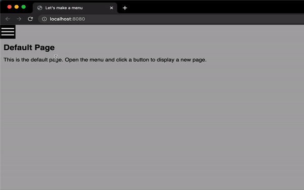

#### Lesson 05
## Extra: Using The Menu

We have a functioning menu so let's make it show some content and  while we're doing that we can add an open and close toggle for the menu as well. This means that we can show a full page of content and display the menu above it when needed.  

### Updating The Content

We can update the json data to include a title and some content for each page, be sure to rename the json node to something appropriate if needed. There is also a special node added under `default_page` so that we can display some content when landing on the page.  
```json
"page_data" : [
    {
        "link_label" : "Link One",
        "title" : "Page One",
        "content" : "This is page one, it is the first page."
    },
```

### Updating The Menu

To slide the menu in and out of view we can use CSS to position the menu absolutely and move it off screen by using a negative `left` value. Changing the `left` value to 0 will bring the div into view and we can transition that value to create an animation.

```css
div.nav {
    width: 350px;
    background-color: black;
    position: absolute;
    left: -350px; /* start menu off screen */
    transition: left 0.45s cubic-bezier(0.5, 1, 0.89, 1);
}

div.open {
    left: 0px;
}
```
For the toggle button we'll use a square div with it's `left` value set to the width of the menu so it is the only visible component when the menu is closed.  
```css
div.nav-toggle {
    width: 44px;
    height: 44px;
    background: black;
    position: absolute;
    left: 350px;
    top: 0px;
    cursor: pointer;
}
```
We create this `<div>` inside the Menu class and use some SVG icons to give user feedback, a cross to close the menu and a hamburger icon to open it. It needs to have an event listener added to the click event and we'll also need to track the menu open state, here we default to the menu being hidden.

```javascript
// create a button to open / close the menu
this.toggleButton = document.createElement( 'div' );
this.toggleButton.className = 'nav-toggle';
this.domElement.appendChild( this.toggleButton );

this.toggleMenuState = this.toggleMenuState.bind( this );
this.toggleButton.onclick = this.toggleMenuState;

// create some SVG icons to display on the button 
this.openMenuIcon = document.createElement( 'svg' );
this.openMenuIcon.innerHTML = `<svg viewBox="0 0 44 44" width="44" height="44">
                                    <rect x="4" y="10" width="36" height="3" fill="white"></rect>
                                    <rect x="4" y="20" width="36" height="3" fill="white"></rect>
                                    <rect x="4" y="30" width="36" height="3" fill="white"></rect>
                                </svg>`;


this.closeMenuIcon = document.createElement( 'svg' );
this.closeMenuIcon.innerHTML = `<svg viewBox="-1 0 44 44" width="44" height="44">
                                    <rect x="12" y="0" width="36" height="3" transform="rotate(45)" fill="white"></rect>
                                    <rect x="-19" y="28" width="36" height="3" transform="rotate(-45)" fill="white"></rect>
                                </svg>`;

// add the SVG to the toggle buttons
this.toggleButton.appendChild( this.openMenuIcon );

// store the current selected button and menu open state
this.currentSelection = -1;
this.menuOpen = false;
```

When a user clicks the toggle button we will either open or close the menu. When we open the menu we change the button icon to the close icon and update the div class to `nav open`. When we close it we change to the hamburger icon and revert the class to `nav`.

```javascript
toggleMenuState( event )
{

    // toggle menuOpen boolean
    this.menuOpen = !this.menuOpen;
    // update nav div class
    this.domElement.className = this.menuOpen ? 'nav open' : 'nav';
    
    // update toggleButton icon
    if( this.menuOpen )
    {

        this.toggleButton.removeChild( this.openMenuIcon );
        this.toggleButton.appendChild( this.closeMenuIcon );

    }
    else
    {

        this.toggleButton.removeChild( this.closeMenuIcon );
        this.toggleButton.appendChild( this.openMenuIcon );

    }

}
```

### Creating A Page Class

This is a really simple example, the page is a div containing a title element `<h2>` and a div for the copy. 

```javascript
export class Page
{

    constructor( title, content )
    {

        this.title = title;;
        this.content = content;

        this.domElement = document.createElement( 'div' );
        this.domElement.className = 'page';

        let titleText = document.createElement( 'h2' );
        titleText.className = 'page-title';
        titleText.innerHTML = title;

        let bodyText = document.createElement( 'div' );
        bodyText.className = 'page-content';
        bodyText.innerHTML = content;

        this.domElement.appendChild( titleText );
        this.domElement.appendChild( bodyText );

    }
    
}
```
```css
/* Page Content */
div.page {
    padding: 58px 10px 10px 10px;
}

div.page h2 {
    margin: 0 0 16px 0;
}
```


### Creating an App

If we are creating a website it's good practice to keep all our code inside an app. Here all the Menu parts have been moved into a new App.js leaving a bare looking index.js

```javascript
import '/src/css/style.css';

// Import the App class
import { App } from './app';

// Create the App
let app = new App();
```

The App class is creating the Menu, handling the clicks and displaying page content. The Menu parts are all the same as before only we're storing them in the class using `this.`

```javascript
// create the menu
this.menu = new Menu( 
    Data.page_data, // the menu will get link text from the page data
    this.handleMenuButtonClick.bind( this ) // the callback function
);

 // create the page_data content
this.pages = [];
for( let i = 0; i < Data.page_data.length; i++ )
{

    this.pages[i] = new Page(
        Data.page_data[i].title,
        Data.page_data[i].content
    );

}

// create the default_page content
this.defaultPage = new Page(
    Data.default_page.title,
    Data.default_page.content
);

// we can use -1 to mean we are showing the default page
this.currentPage = -1;
```

We need to add a function to swap the page content then call this when the user clicks on a new menu item so that the screen is updated.

```javascript
updatePageContent( pageIndex )
{

    // remove the current page, otherwise remove the default page
    if( this.currentPage != -1 )
    {

        document.body.removeChild( this.pages[ this.currentPage ].domElement );

    }
    else
    {

        document.body.removeChild( this.defaultPage.domElement );

    }

    // update the current page
    this.currentPage = pageIndex;

    // add the new page to the document body
    document.body.appendChild( this.pages[ this.currentPage].domElement )

}
```



