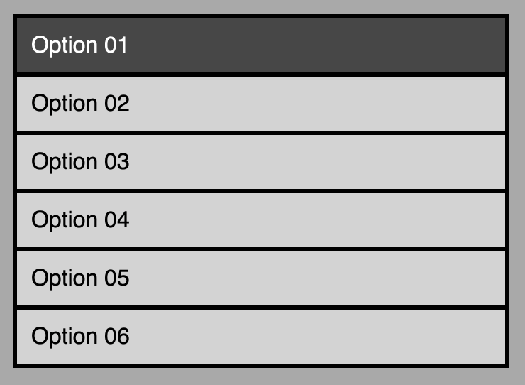

#### Lesson 01
## Static HTML and CSS

Building a new menu for a website should generally start with creating HTML and CSS that works well before you dive into any javascript.  

Starting this way means we can address any layout issues or styling problems without worrying aobut whether our code is causing errors. Essentially when we use javascript to create these elements we still style them with the same css anyway, we can just apply the class and id tags to grab the style.


#### Buttons

While an anchor tab that only contains text works as a link and may be sufficient in some cases, it's not a great user experience because only the text itself is clickable.  
  
By giving our buttons a bigger hit area it becomes easier for people to navigate both via touch and by giving hints with mouse cursors.  

To achieve this we can add a `<div>` inside the `<a>` tag and expand it to fill whatever area is needed.

```html
<ul class="nav">
    <li class="nav">
        <a class="nav" href="#01">
            <div class="nav-item">
                Option 01
            </div>
        </a>
    </li>
</ul>
```
  
Now we only need a little css to give the buttons a bigger hit area.  
```css
div.nav-item {
    padding:10px;
}
```

Give the list item `<li>` a hover state so users get visual feedback to help with navigation. 
```css
li.nav {
    display: block;
    list-style-type: none;
    background-color:lightgrey;
    margin: 3px;
}

li.nav:hover {
    background-color: rgb(71, 71, 71);
}
```

And that's it, the basic menu is finished.

